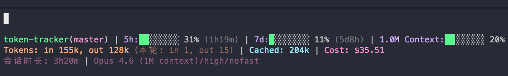
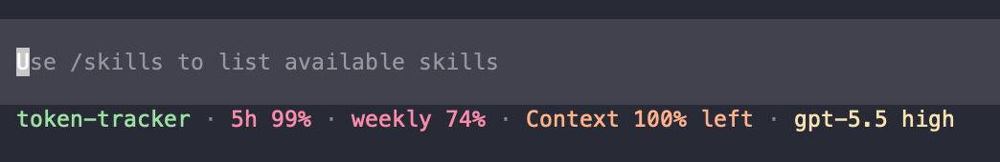
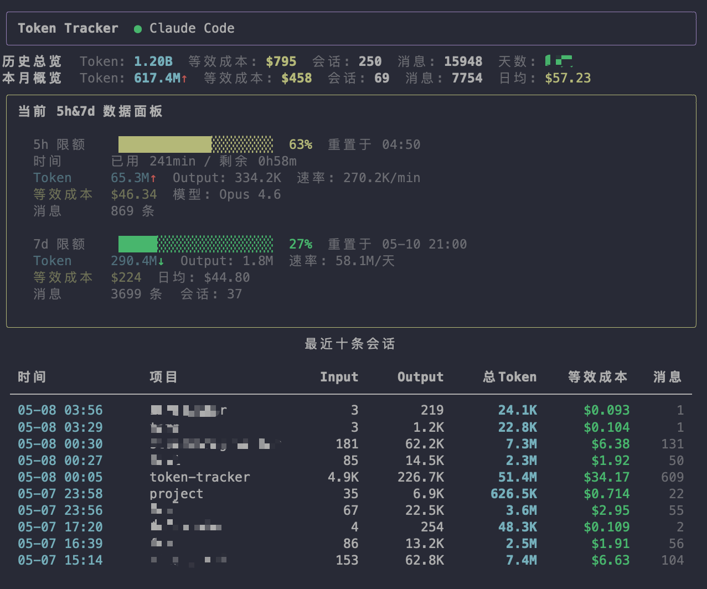
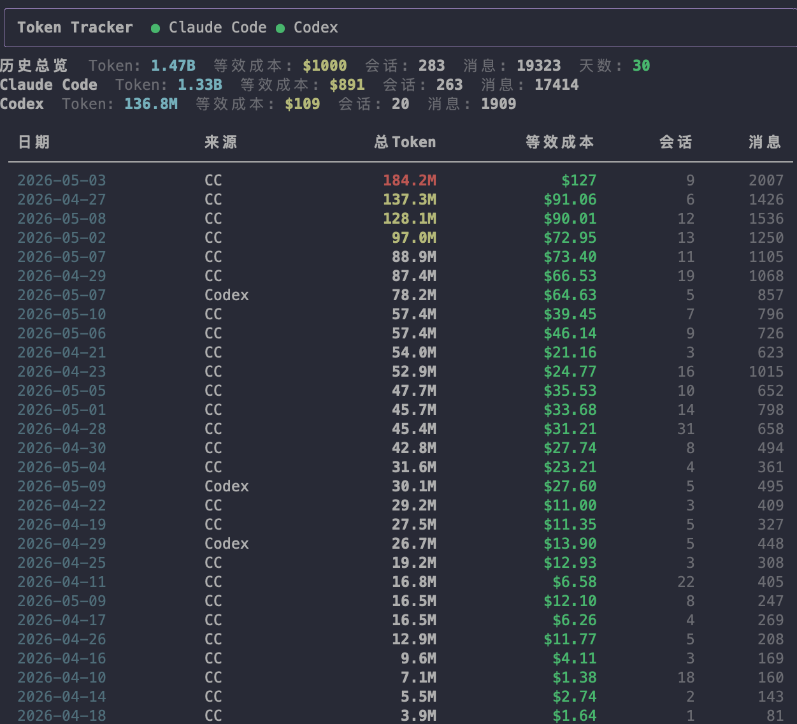
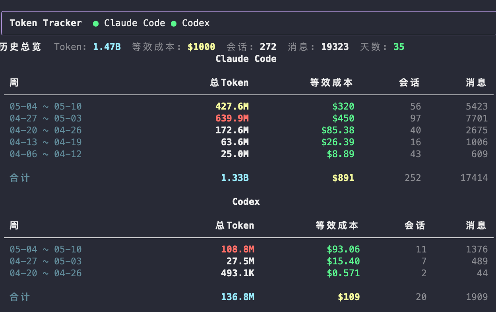
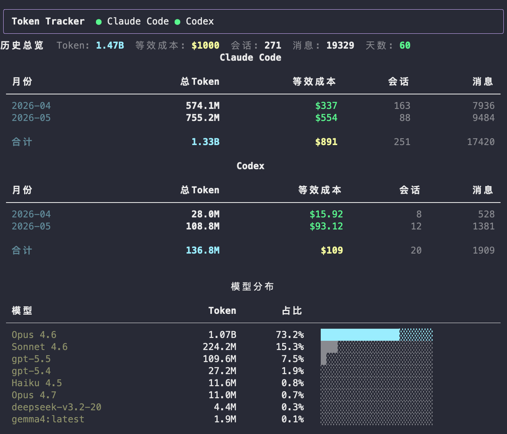

# Token Tracker

Track token usage across local AI agents. Supports **Claude Code** and **Codex**.

Custom StatusLine integration + CLI Dashboard — see token usage, cost, and rate limits at a glance.

  

[中文](README.md)

## StatusLine

`tt setup` auto-configures status lines for Claude Code and Codex, auto-upgraded when the script updates.

**Claude Code**: Built on the official custom StatusLine API — all data comes directly from local Claude, accurate with zero guesswork



The status line has three rows, left to right:

| Row | Field | Description |
|-----|-------|-------------|
| 1 | `project(branch)` | Current project directory + Git branch, `*` indicates uncommitted changes |
| 1 | `5h: ██░ 31% (1h19m)` | 5-hour sliding window quota usage, countdown to reset in parentheses |
| 1 | `7d: ██░ 11% (5d8h)` | 7-day sliding window quota usage |
| 1 | `1.0M Context: ██░ 20%` | Total context window size and usage percentage |
| 2 | `Tokens: in 155k, out 128k` | Cumulative input/output tokens for the current session |
| 2 | `(Turn: in 1, out 15)` | Token usage for the current conversation turn |
| 2 | `Cached: 204k` | Prompt cache hit tokens for the current turn |
| 2 | `Cost: $35.51` | Estimated session cost (based on official pricing) |
| 3 | `Model: Opus 4.6/high/nofast` | Model / thinking level / fast mode status |
| 3 | `Duration: 1h33m` | Current session elapsed time |

> When terminal width is limited, the display auto-degrades: first hides reset countdowns, then simplifies progress bars to plain percentages.

**Codex**: Custom StatusLine rendering is not yet supported by Codex, so the official default style is reused. `tt setup` only writes the field configuration.



| Field | Meaning |
|------|------|
| `project` | Current project directory name |
| `five-hour-limit` | 5-hour rolling-window quota usage |
| `weekly-limit` | 7-day rolling-window quota usage |
| `context-remaining` | Remaining percentage of the context window |
| `model-with-reasoning` | Model name + reasoning level (e.g. `gpt-5-codex/high`) |

## Dashboard & Daily / Weekly / Monthly Reports









## Features

- **Multi-agent tracking** — Claude Code + Codex in one place, interactive tab switching
- **Status line integration** — Claude Code statusLine + Codex status_line, auto-configured on first run, auto-upgraded on script updates
- **Rate limit monitoring** — real-time 5h / 7d quota usage with reset countdown
- **Cost analysis** — per-session, daily, weekly, monthly cost breakdown with per-agent grouping
- **Pricing resolution** — litellm live pricing with built-in official-price fallback; new models in a known family are priced automatically (incl. Claude Fable 5 / Opus 4.8), and unknown models trigger an explicit warning instead of silently counting as $0
- **Session insights** — project, model, duration, message count per session
- **Zero config** — auto-detects installed agents, reads local data directly
- **Privacy first** — all data stays local, no collection or upload of any user information, lightweight and worry-free

## Install

```bash
curl -sSL https://raw.githubusercontent.com/stormzhang/token-tracker/main/install.sh | bash
```

Or via pip:

```bash
pip install --force-reinstall token-tracker && tt setup
```

## Usage

```bash
tt setup          # initialize and configure Claude Code + Codex status_line
tt                # interactive dashboard (arrow keys to switch agents)
tt claude         # Claude Code only
tt codex          # Codex only
tt daily          # daily summary (sorted by token usage)
tt weekly         # weekly summary (per-agent grouping)
tt monthly        # monthly summary (per-agent grouping)
tt sessions       # last 20 session details
tt unsetup        # uninstall and restore previous config
```

### Report Sorting

All report commands support `--sort` and `--asc/--desc` flags:

```bash
tt daily --sort cost --desc     # sort by cost, descending
tt sessions --sort tokens --asc # sort by tokens, ascending
```

Available sort fields: `tokens` / `cost` / `messages` / `time` / `input` / `output`

### Dashboard Shortcuts

| Key | Action |
|-----|--------|
| `←` `→` | Switch agent |
| `↑` `↓` | Scroll content |
| `s` | Cycle sort field (time → tokens → cost → messages) |
| `r` | Reverse sort direction |
| `+` / `-` | Adjust session count (±10, min 10) |
| `q` | Quit |

## Third-Party Coding Plan Quota Integration

Official APIs automatically inject quota data into the status line, but third-party platforms (like Volcano Engine Ark) don't support this. Token Tracker provides an extensible Provider architecture to fetch Coding Plan usage data via scripts or APIs.

### Configuration

Configure the quota provider in `~/.claude/tt-config.json`:

```json
{
  "rate_provider": {
    "type": "script",
    "command": "python ~/.claude/tt-ark-quota.py",
    "cache_ttl": 60,
    "timeout": 10
  }
}
```

Configuration options:

| Field | Default | Description |
|-------|---------|-------------|
| `type` | — | Must be `script` |
| `command` | — | Command to execute |
| `cache_ttl` | `60` | Cache duration in seconds to avoid frequent script calls (recommended ≥ 30) |
| `timeout` | `10` | Script execution timeout in seconds |

### Script Output Format

Custom scripts must output standard JSON format:

```json
{
  "five_hour": {
    "used_percentage": 31.5,
    "resets_at": 1718457600
  },
  "seven_day": {
    "used_percentage": 12.3,
    "resets_at": 1718889600
  },
  "monthly": {
    "used_percentage": 8.7,
    "resets_at": 1719753600
  },
  "source": "Volcano Engine Ark"
}
```

### Volcano Engine Ark Example

Create `~/.claude/tt-ark-quota.py`:

```python
#!/usr/bin/env python3
import json
import urllib.request
import urllib.error
import sys

# Copy Cookie and x-csrf-token from browser developer tools
COOKIE = "monitor_huoshan_web_id=xxx; connect.sid=xxx; ..."
X_CSRF_TOKEN = "xxx"

API_URL = "https://console.volcengine.com/api/top/ark/cn-beijing/2024-01-01/GetCodingPlanUsage?"

def main():
    try:
        req = urllib.request.Request(API_URL, method="POST")
        req.add_header("cookie", COOKIE)
        req.add_header("x-csrf-token", X_CSRF_TOKEN)

        with urllib.request.urlopen(req, data=b"{}", timeout=10) as resp:
            data = json.loads(resp.read().decode())

        quota_map = {}
        for item in data.get("Result", {}).get("QuotaUsage", []):
            level = item.get("Level")
            percent = item.get("Percent")
            reset = item.get("ResetTimestamp")
            if level == "session":
                quota_map["five_hour"] = {"used_percentage": percent, "resets_at": reset}
            elif level == "weekly":
                quota_map["seven_day"] = {"used_percentage": percent, "resets_at": reset}
            elif level == "monthly":
                quota_map["monthly"] = {"used_percentage": percent, "resets_at": reset}

        print(json.dumps({**quota_map, "source": "Volcano Engine Ark"}))
    except urllib.error.HTTPError as e:
        print(f"HTTP Error: {e.code}", file=sys.stderr)
        sys.exit(1)
    except Exception as e:
        print(f"Error: {e}", file=sys.stderr)
        sys.exit(1)

if __name__ == "__main__":
    main()
```

### Diagnostic Commands

After configuration, use diagnostic commands to verify:

```bash
tt quota           # show quota status and provider info
tt quota --debug   # detailed debug output (including configuration)
```

## Data Sources

| Agent | Path | Format |
|-------|------|--------|
| Claude Code | `~/.claude/projects/*/` | JSONL (per-message usage) |
| Codex | `~/.codex/sessions/` | JSONL + SQLite |

Token Tracker is **read-only** — it never modifies any agent data.

## Requirements

- Python 3.11+
- [Rich](https://github.com/Textualize/rich) (auto-installed)

## Development

```bash
git clone https://github.com/stormzhang/token-tracker && cd token-tracker
uv run --extra dev pytest                # run tests
uv run --extra dev ruff check src tests  # lint
```

The package uses the standard src layout (`src/token_tracker/`): distribution name `token-tracker`, import name `token_tracker` (since 0.4.0).

## TODO

More reports and multi-dimensional analysis coming soon.

## License

Copyright (c) 2026 stormzhang. MIT License.
